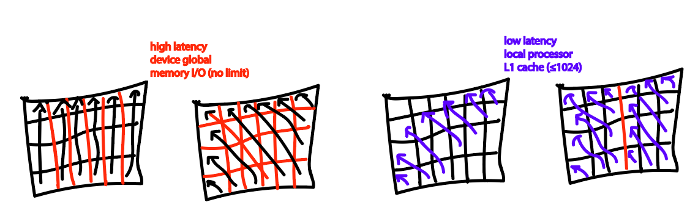
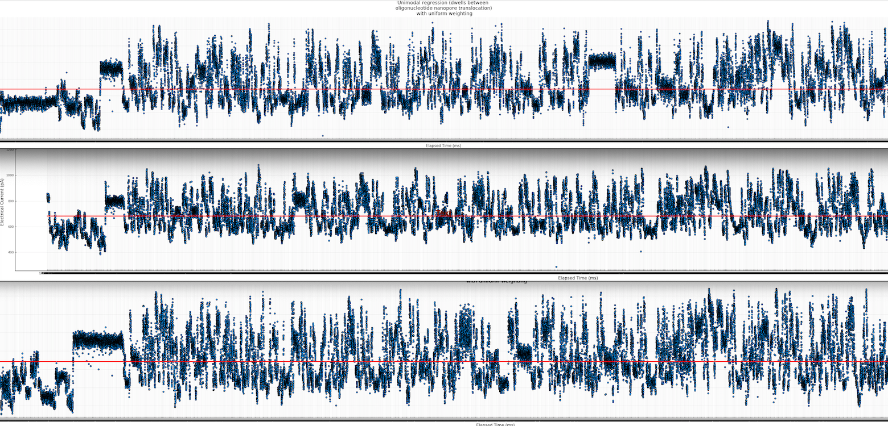
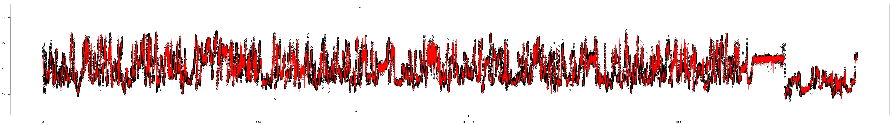
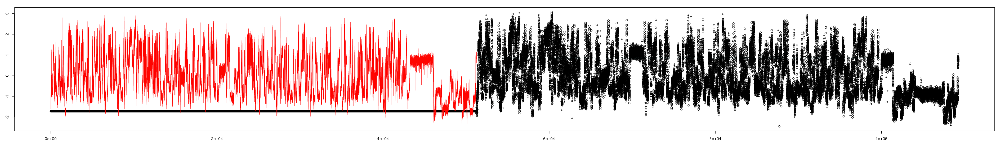
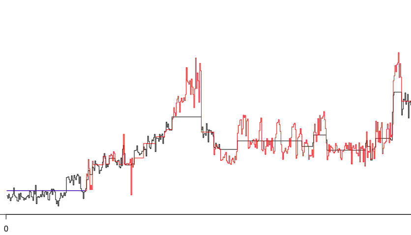
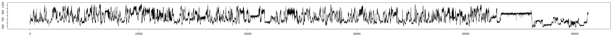
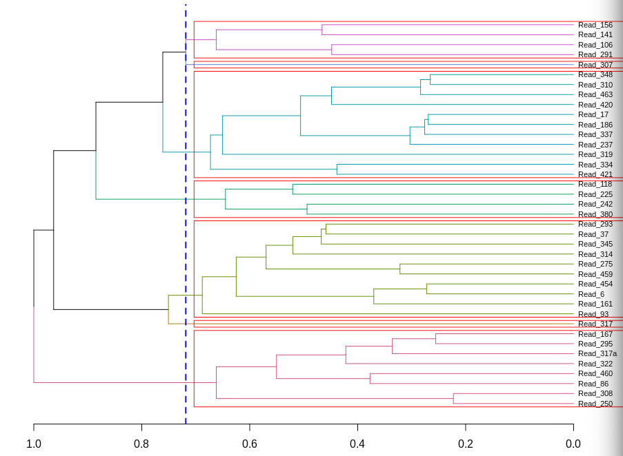

# OpenDBA
GPU-accelerated Dynamic Time Warp (DTW) Barycenter Averaging

*tl;dr this code makes averaging large sets of time series data at least 100x faster than existing single-thread CPU-based methods, and as a bonus generates a distance matrix, facilitating warped time series cluster analysis (e.g. white box analysis of nanopore direct RNA sequencing signals). It also employs a novel "stripe" mode to enable full DTW calculation for sequences up to several million elements long each.*

## Compiling
Requires CUDA Toolkit 7 or later: https://developer.nvidia.com/cuda-toolkit

This code has only been tested on Linux.

```bash
git clone --recurse-submodules https://github.com/nodrogluap/OpenDBA/
cd OpenDBA
make
```
OR, if you plan on using nanopore data for input you need HDF5 support (assuming you've pre-installed the [HDF5 libraries](https://www.hdfgroup.org/downloads/hdf5/)):

```bash
git clone --recurse-submodules https://github.com/nodrogluap/OpenDBA/
cd OpenDBA
make HDF5_SUPPORTED=1
make tests HDF5_SUPPORTED=1 
```

If you want to run this code on a GPU with Compute Capability less than 6.1 (manufactured before ~2016), you will need to remove the double precision floating point support from openDBA.cu by compiling like so:

```bash
make DOUBLE_UNSUPPORTED=1
```

## Quick Start
First, make sure you have an NVIDIA GPU in your computer.

**Note that the first ('medoid' finding) stage of the DBA algorithm is to compute all-vs-all DTW comparison pairs. While this GPU program is greatly accelerated, I suggest computing the average of less than 5000 sequences, as the O(NxN) comparisons get quite onerous (>25M DTWs) beyond that even on a modern GPU. For truely massive datasets, if subsetting is infeasible, you might want to compute averages in groups of ~5K, then compute the average of the averages in another round of OpenDBA for example.**

If you have up to thousands of text files with one number per line, generate (1) a sequence distance matrix and (2) a consensus sequence using the following command:

```bash
openDBA text float global output_prefix 0 /dev/null 1 input_numeric_series*.txt
```
Outputs are in `output_prefix.pair_dists.txt` and `output_prefix.avg.txt`. See all command line options by running the program without any arguments.

Bio folks: Examples for Oxford Nanopore Technologies data analysis are provided at the bottom of this file.

Comp Sci folks: An input file can also be a tab delimited values file, with one sequence per line and a sequence label in the first column of each line (a.k.a. [UCR Time Series Classification Archive format](https://www.cs.ucr.edu/~eamonn/time_series_data_2018/)). Specify `tsv` instead of `text` on the command line.

## Licensing
This code is distributed under the GNU Public License v3.  Please contact the author, Paul Gordon (gordonp@ucalgary.ca), for alternative licensing possibilities.

## Method details (or, Why Should I Use This?)

For a video describing the main features of OpenDBA, please see this [GTC 2020 presentation](https://developer.nvidia.com/gtc/2020/video/s21121-vid).

DBA is the algorithm for optimal alignment of multiple numeric sequences to each other. This is the arbitrary quantitative data equivalent of the well characterized nominal data [Multiple Sequence Alignment](https://en.wikipedia.org/wiki/Multiple_sequence_alignment) problem in bioinformatics (DNA and amino acid sequences).  For original DBA details please see https://github.com/fpetitjean/DBA. Four features of this implementation are worth highlighting.

1. The first and most expensive step of DBA is the identification of a "medoid" sequence with minimum [DTW](https://en.wikipedia.org/wiki/Dynamic_time_warping) residual sum of squares among all input sequences, which requires an all-vs-all DTW pair analysis. OpenDBA achieves up to 3 orders of magnitude speedup over the original DBA implementation by running the embarrasingly parallelizable all-vs-all DTW computations as CUDA (Nvidia GPU) kernels. A novel DTW alignment method is used that minimizes the GPU global device memory requirements of this parallel computation, by calculating each *full* DTW cost matrix in stages, by vertical swath in each threadblock's L1 cache (low latency), trickling out only the intermediate result at the right edge of each swath back to device global memory (high latency) before the next swath is computed. Our method (far right) combines the best of the unlimited cost matrix size capabilities of existing [vertical](https://www.ncbi.nlm.nih.gov/pmc/articles/PMC3943253/) and [diagonal](https://www.dcs.warwick.ac.uk/~liganghe/papers/BigData%282018-NO1%29-2.pdf) [implementations](https://github.com/haimingzhao/dtw-pattern/tree/master) of global mem GPU DTW (left two) with the Sakoe-Chiba banded implementation in [CUDADTW](https://github.com/gravitino/cudadtw) (second from right). Arrows represent sets of matrix values that can be computed in parallel. 



In this way, thousands of sequence pair cost matrices are computed in parallel in minutes on GPUs with only a few GB of GPU RAM. If multiple GPUs are available on one machine they will be automatically used to scale the speedup almost linearly.

2. Many DTW and DBA implementations speedup computation and reduce memory burden by restricting the DTW Cost Matrix calculation with an Itakura Parallogram or a Sakoe-Chiba band, which limits validity of the multiple alignment to sequences that are effectively the same end-to-end once small sequence compressions and attentuations (time warps) are considered. Because OpenDBA computes the full DTW cost matrix, unrestricted subsequence alignment is possible in the first sequence of the pair (i.e. incurring no penalty if the best alignment is not end-to-end in the pair's first sequence). In DTW parlance, these are special alignment states called "open start" and "open end". To our knowledge, this is the first implementation of DBA that allows open start and open end alignments, hence OpenDBA.

3. This implementation introduces a novel "striped" mode for calculating the DTW path through very large matrices, such as generated by a doing a full DTW alignment of two 1M element sequences (unfathomable with most extant DTW methods). In "stripe" mode, the cumulative cost at every 1024th column is calculated without storing the step choices left-to-right, then the DTW alignment is rerun in 1024-wide stripes from right-to-left to capture the backtraced path. This costs on average 1.5x the step calculations, but reduces the memory requirement by 256x (for floating point number input).

4. The results of the initial all-vs-all DTW comparisons are stored to a distance matrix file (upper right format), so that it can be loaded into other software to do cluster analysis. For example, to perform complete linkage clustering and visualization of the time-warp corrected sequences (some series truncated, so open end mode required), using the R programming language:

```bash
openDBA text float open_end foo 0 /dev/null numeric_series*.txt
R
```

```R
  tab <- read.table("foo.pair_dists.txt", sep="\t", row.names=1, header=FALSE)
  colnames(tab) <- rownames(tab)
  dis <- as.dist(t(tab), diag=TRUE)
  hc <- hclust(dis)
  plot(hc)
```

## How does it know when to stop refining the multiple alignment average?

By default the desired "convergence delta" is zero.  All of the input sequences are Z-normalized (i.e. shifted and scaled to have a mean of zero and a standard deviation of 1). The centroid output from this program is generated by first doing DTW alignments of all input sequences against the medoid (the representative input sequence with the smallest sum of squares in the all-vs-all comparison) and averaging to generate a first round centroid, then iteratively all sequences are aligned against this new synthetic centroid sequence to refine it until "convergence". The convergence delta is the maximum any point in the centroid changes between rounds of alignment and averaging.  A stop criterion of 0 therefore means that the centroid is outputted when no single sequence value changes during a refinement iteration. 

## How do I use this for Oxford Nanopore data?

Although DBA and this software are very broadly applicable to time series in various domains of study, one of the main motivations for developing an open end DBA implementation is the clustering and consensus analysis of direct RNA data from [Oxford Nanopore Technologies](https://nanoporetech.com/applications/rna-sequencing) devices. The raw 3000 or 4000Hz picoamperage sample measurements are stored in a dialect of [HDF5](https://www.hdfgroup.org/solutions/hdf5/) files called FAST5. By default, OpenDBA does not require HDF5 support to compile, and therefore does not process FAST5 files by default.  To enable FAST5 input file support, install the HDF5 libraries on your machine (e.g. using yum or apt-get), then compile OpenDBA with ```make HDF5_SUPPORTED=1```. That should do it! If your package manager installs HDF5 in a weird place and you get compiler messages like ```fatal error: hdf5.h: No such file or directory```, hunt down where the package manager installed HDF5 and adjust the make command accordingly such as ```make HDF5_SUPPORTED=1 CPATH=/usr/include/hdf5/serial LIBRARY_PATH=/usr/lib/x86_64-linux-gnu/hdf5/serial``` on a DGX workstation.

Now we can do a multiple alignment of the raw signals using DBA to generate a consensus signal, and a distance matrix for cluster analysis like in the previous sections.

```bash
openDBA fast5 float open_end output_prefix 0 /dev/null 1 ont_folder_name/*.fast5
```

OpenDBA has a built-in CUDA accelerated unimodal segmentation algorithm. To segment direct RNA signal data from ONT into dwell "events" type:

```bash
openDBA fast5 float open_end output_prefix 6 /dev/null 1 ont_folder_name/*.fast5
```

Where 6 is a hint to the segmenter as to how big spurious events caused by sensor noise can be (5 in this case).  The repository also includes a consensus leader sequencing adapter signal for ONT RNA experiments, so this can be chopped off the start of the inputs by replacing the /dev/null argument on the command line:

```bash
openDBA fast5 float open_end output_prefix 4 direct_rna_leader_float.txt 1 ont_folder_name/*.fast5
```

Below is an example of three nanopore picoamperage signals for a viral RNA sequence (i.e. three partial copies of the virus genome going through different sensors on the device at different times). By using an open-end DTW alignment, the fact that genome fragments are of different length *and information content at the end* does not adversely affect the consensus building. The time dimension compressions and dilations (i.e. time warp due to variation in the motor protein ratcheting rate) within the shared signal section are obvious when you mentally align large peaks and valley in the middle of the graphs.



The pairwise alignment of the first and third sequences shows that they are actually nearly identical after dynamic time warping is performed (note that the sequences have been reversed, purely for practicality in processing the DTW algo backtracking output).



The second sequence is considerably longer (and has more real underlying information at the end), but in our implementation these extra value are ignored in the consensus building, as the DBA algorithm by definition results in a sequence the length of the medoid (in our case, the 3rd sequence). If we did not ignore the extra information in the longer sequence, the DTW would start doing ugly stuff, like deciding to not align the sequences at all and find the lowest cost by just going on the very edge of the cost matrix, a so-called "pathological alignment":



This is mitigated in the OpenDBA software by reversing the open end step option to the centroid if the input sequence is longer than it. As an example, the no-cost extension of the alignment between the longer black sequence (which I've truncated for visualization purposes) and the red medoid is shown in blue below, improving the overall alignment by anchoring the end of the "real" cost matrix 100 values in.  



The consensus for 3 raw sequences starts to smooth out the signal (less vertical "fat"), allowing us to look at fundamental properties of molecules like dwell time bias, irreducible noise, transition effects, etc. without a reference bias or including only signals that were well interpreted by a neural network basecaller.  On an RTX 2080 Ti GPU, consensus was calculated in 1 minute and 34 seconds, whereas the Java DBA implementation took 47 minutes. Due to the inherent parallelism of OpenDBA, consensus of sets of hundreds of sequences take only marginally longer than for 3 sequences.



## Sequence Clustering

OpenDBA now has initial support for clustering, which is useful when the input signals represent different underlying sets of information and therefore global averaging would not make sense. The coarseness of the clustering is controlled by the last parameter before the input files are listed on the command line. When in the range \[0,1) this parameter is a cutoff threshold in a normalized distance tree (after complete linkage clustering), therefore setting the threshold to 1 (the normalized tree height) makes all sequences part of one cluster for averaging, whereas 0 would only merge sequences that were exactly the same. A value of 0.71 in the following cluster tree would cause the formation of 7 clusters (including singletons Read_317 and Read_307):



When the value is greater than 1, the integer value is taken and used to perform [K-means clustering](https://en.wikipedia.org/wiki/K-means_clustering), e.g. to generate 13 clusters because you think you have 13 different direct RNA transcripts:

```bash
openDBA fast5 float open_end output_prefix 4 direct_rna_leader_float.txt 13 ont_folder_name/*.fast5
```

Note that the K-means clustering ignores singleton branches in the dendrogram, so reduce the odds of overclustering due to errant data you did not expect. This entails that the actual number "K" in K-means may be greater than the K specified on the command line, to accomodate these singletons.  The actual K used is printed in the standard error output to note the final value of K used.

## Writing FAST5 data

Given a *single* multi-FAST5 OpenDBA will now write the cluster sequence averages (including singletons verbatim) to ```outputprefix.avg.fast5```. This file can then be used as input for basecalling (has been tested with ONT's Guppy software). Particularly for direct RNA this can be useful, as single read basecall quality is still fairly poor. Averaging multiple sequences at the raw signal level can increase the accuracy of the basecalling as a kind of denoising step. You must not chop the prefix, and segmentation must be disabled. The following will generate a FAST5 file with a single consensus raw signal from the whole of the test input:

```
openDBA fast5 float open_end test_out 0 /dev/null 1 test_in.fast5
```

For the moment, if you have multiple FAST5 files you'd like to average at the raw signal level, this must be done as a preprocessing step before you use OpenDBA. If you expect 13 different transcripts, and you want to output a consensus raw signal for all of them, simply change the clustering parameter:

```
openDBA fast5 float open_end test_out 0 /dev/null 13 test_in.fast5
```

## Finding base modifications and minor fraction variants

Preliminary support for identifying variants or base modifications that affect nanopore signal is provided by the rna_multimodality.sh script. After an OpenDBA run, any generated transcript cluster can be tested for positions where the picoamperage across all cluster reads appears to be multimodal. By default Hartigans' Dip Test is used as a highly precise estimate (low false positive rate), then [Kernel Density Estimation + Excess Mass](https://link.springer.com/article/10.1007/s11749-018-0611-5) as a high recall estimate (low false negative rate). The script takes two arguments, the length of the reference RNA (e.g. 29903 for SARS-CoV-2 direct RNA data) for position reporting, and the cluster prefix. In the case below, we generate 30 clusters, and decide to look at the multimodality of consensus sites using the reads in cluster 14

```bash
openDBA fast5 float open_end myexperiment 4 direct_rna_leader_float.txt 30 ont_folder_name/*.fast5
sh rna_multimodality.sh 29903 myexperiment.14
```
yields two files ``myexperiment.14.multimodal.diptest.txt`` and ``myexperiment.14.multimodal.kde_smoothing_plus_excess_mass.txt``...
```
Hartigan Dip Test (low FP): 
  [1] 26053 26339 26604 26957 27320 27543 27667 27880 28215 28714 28983 29187 
 [13] 29428 29467 29715 29785
KDE + Excess Mass (low FN): 
  [1] 24831 25144 25581 25732 25944 25998 25999 26053 26062 26070 26076 26151
 [13] 26206 26312 26339 26408 26574 26581 26587 26604 26673 26706 26753 26957
 [25] 27043 27114 27160 27197 27272 27320 27324 27348 27398 27432 27440 27448
 [37] 27543 27601 27647 27667 27691 27758 27841 27880 27914 27962 28013 28101
 [49] 28121 28155 28165 28215 28269 28280 28368 28383 28462 28488 28508 28526
 [61] 28563 28588 28697 28700 28702 28714 28739 28769 28827 28878 28892 28975
 [73] 28983 29094 29101 29124 29187 29200 29249 29263 29266 29318 29332 29341
 [85] 29351 29428 29467 29468 29509 29580 29686 29715 29719 29750 29752 29765
 [97] 29766 29772 29785 29875
```

To use these tests, one must have ``R`` installed with the ``multimode`` and ``diptest`` packages. 

## Common Problems &amp; Solutions

If the code does not compile, you may have encountered a bug in CentOS 7's glibc implementation. The solution can be found [here](https://github.com/nodrogluap/OpenDBA/issues/9).

If compiling the code with gcc you get ```error: parameter packs not expanded with '...'```, you have likely run into a bug in CUDA 11.6.0. Please upgrade to CUDA 11.6.4.

If you are parsing a FAST5 file and encounter errors like `could not get ##### Signal from multi FAST5 (HDF5) file`, the file likely contains data using a [vendor-specific compression format called VBZ](https://github.com/nanoporetech/vbz_compression). In this case, you will either need to precompile the dynamically linked HDF5 plugin for decoding it, or have OpenDBA's Makefile do it for you with `make plugins`. This plugin is found at run-time by the HDF5 library by using the environment variable `HDF5_PLUGIN_PATH=/dir/where/you/compiled/libvbz_hdf_plugin.so`, but if you used the OpenDBA make plugins command this will be automatically found by running openDBA through the wrapper script `openDBA.sh`. 

If running `make plugins` causes errors, you may not have all the build environment tools required to build the VBZ plugin (i.e. cmake, libzstd, libhdf5). If you are a [conda user](https://conda.io/projects/conda/en/latest/user-guide/install/index.html), the `opendba.yml` file can be used to create the right build environment:

```bash
conda env create -f opendba.yml
```

Then any time you want to run the compile or run start OpenDBA with:

```
conda activate opendba
```

