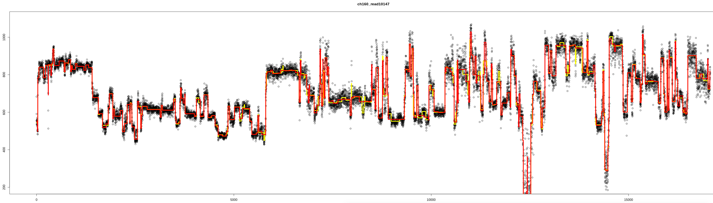

# OpenDBA
GPU-accelerated Dynamic Time Warp (DTW) Barycenter Averaging

*tl;dr this code makes averaging large sets of time series data at least 100x faster than existing single-thread CPU-based methods, and as a bonus generates a distance matrix, facilitating warped time series cluster analysis (e.g. white box analysis of nanopore direct RNA sequencing signals).*

## Compiling
Requires CUDA Toolkit 7 or later: https://developer.nvidia.com/cuda-toolkit

This code has only been tested on Linux.

```bash
make
```

If you want to run this code on a GPU with Compute Capability less than 6.1 (manufactured before ~2016), you will need to remove the double precision floating point support from openDBA.cu by compiling like so:

```bash
make DOUBLE_UNSUPPORTED=1
```

## Quick Start
First, make sure you have an NVIDIA GPU in your computer.

If you have up to thousands of text files with one number per line, generate (1) a sequence distance matrix and (2) a consensus sequence using the following command:

```bash
openDBA text float global output_prefix 0.05 input_numeric_series*.txt
```
Outputs are in `output_prefix.pair_dists.txt` and `output_prefix.avg.txt`. See all command line options by running the program without any arguments.

Bio folks: Examples for Oxford Nanopore Technologies data analysis are provided at the bottom of this file.

Comp Sci folks: An input file can also be a tab delimited values file, with one sequence per line and a sequence label in the first column of each line (a.k.a. [UCR Time Series Classification Archive format](https://www.cs.ucr.edu/~eamonn/time_series_data_2018/)). Specify `tsv` instead of `text` on the command line.

## Licensing
This code is distributed under the GNU Public License v3.  Please contact the author, Paul Gordon (gordonp@ucalgary.ca), for alternative licensing possibilities.

## Method details (or, Why Should I Use This?)

DBA is the algorithm for optimal alignment of multiple numeric sequences to each other. This is the arbitrary quantitative data equivalent of the well characterized nominal data [Multiple Sequence Alignment](https://en.wikipedia.org/wiki/Multiple_sequence_alignment) problem in bioinformatics (DNA and amino acid sequences).  For original DBA details please see https://github.com/fpetitjean/DBA. Three features of this implementation are worth highlighting.

1. The first and most expensive step of DBA is the identification of a "medoid" sequence with minimum [DTW](https://en.wikipedia.org/wiki/Dynamic_time_warping) residual sum of squares among all input sequences, which requires an all-vs-all DTW pair analysis. OpenDBA achieves up to 3 orders of magnitude speedup over the original DBA implementation by running the embarrasingly parallelizable all-vs-all DTW computations as CUDA (Nvidia GPU) kernels. A novel DTW alignment method is used that minimizes the GPU global device memory requirements of this parallel computation, by calculating each *full* DTW cost matrix in stages, by vertical swath in each threadblock's L1 cache (low latency), trickling out only the intermediate result at the right edge of each swath back to device global memory (high latency) before the next swath is computed. Our method (far right) combines the best of the unlimited cost matrix size capabilities of existing [vertical](https://www.ncbi.nlm.nih.gov/pmc/articles/PMC3943253/) and [diagonal](https://www.dcs.warwick.ac.uk/~liganghe/papers/BigData%282018-NO1%29-2.pdf) [implementations](https://github.com/haimingzhao/dtw-pattern/tree/master) of global mem GPU DTW (left two) with the Sakoe-Chiba banded implementation in [CUDADTW](https://github.com/gravitino/cudadtw) (second from right). Arrows represent sets of matrix values that can be computed in parallel. 


In this way, thousands of sequence pair cost matrices be compared in parallel in minutes on GPUs with only a few GB of GPU RAM. If multiple GPUs are available on one machine they will be automatically used to scale the speedup almost linearly.

2. Many DTW and DBA implementations speedup computation and reduce memory burden by restricting the DTW Cost Matrix calculation with an Itakura Parallogram or a Sakoe-Chiba band, which limits validity of the multiple alignment to sequences that are effectively the same end-to-end once small sequence compressions and attentuations (time warps) are considered. Because OpenDBA computes the full DTW cost matrix, unrestricted subsequence alignment is possible in the first sequence of the pair (i.e. incurring no penalty if the best alignment is not end-to-end in the pair's first sequence). In DTW parlance, these are special alignment states called "open start" and "open end". To our knowledge, this is the first implementation of DBA that allows open start and open end alignments, hence OpenDBA.

3. The results of the initial all-vs-all DTW comparisons are stored to a distance matrix file (upper right format), so that it can be loaded into other software to do cluster analysis. For example, to perform complete linkage clustering and visualization of the time-warp corrected sequences (some series truncated, so open end mode required), using the R programming language:

```bash
openDBA text float open_end foo 0.05 numeric_series*.txt
R
```

```R
  tab <- read.table("foo.pair_dists.txt", sep="\t", row.names=1, header=FALSE)
  colnames(tab) <- rownames(tab)
  dis <- as.dist(t(tab), diag=TRUE)
  hc <- hclust(dis)
  plot(hc)
```

## How do I use this for Oxford Nanopore data?

Although DBA and this software are very broadly applicable to time series in various domains of study, one of the main motivations for developing an open end DBA implementation is the clustering and consensus analysis of direct RNA data from [Oxford Nanopore Technologies](https://nanoporetech.com/applications/rna-sequencing) devices. The raw 4000Hz picoamperage measurements are stored in a dialect of [HDF5](https://www.hdfgroup.org/solutions/hdf5/) files called FAST5. A [Julia](https://julialang.org/) script is provided in this repository to extract these data from FAST5 files, and perform two pass adaptive dynamic programming segmentation of the raw signal to reduce the 4000Hz signal to putative electrical current levels for each RNA (or DNA) base translocated though the nanopore sensor.  The segmentation algorithm is computationally intensive and slow (a CUDA version is not quite ready for release yet), but minimizes the residual sum of squares for segmenting the specified raw event window, given some known upper limit on the translocation rate and the desire to ignore very short lived outlier measurements. It's a nanopore-signal-specific refinement of Justin Wilmert's [Bellman's K-segmentation implementation](http://homepages.spa.umn.edu/~willmert/science/ksegments/). 

Install Julia 1.0+ using [conda](https://github.com/ucvm/synergy/wiki/Using-Conda), then run an interactive Julia interpreter to install the required packages. 

```bash
conda install julia
julia
```

```Julia
import Pkg
Pkg.add("HDF5")
Pkg.add("FreqTables");
Pkg.add("Statistics");
Pkg.add("StatsBase");
```

Now you can run the segmentation script, for example for direct RNA the translocation rate is theoretically 70 bases per second (if there is plentiful ATP to fuel the motor protein, and no RNA secondary structures gumming up the racheting process), and the sensor picoamperage is measured at 4000Hz.  We will run a first pass segmentation (which accounts for wandering drift in the nanopore direct current) 400 raw samples at a time. This is fast. We will then do a second pass segentation on 3000 sample sat a time. This second pass is slower as 3000 samples can be segmented a lot more ways than 400. You can set this to anything you want, the larger the more accurate, but obviously the larger the value the longer it takes and improvements are only marginal (nothing above 4000 is suggested for the second pass).

```bash
julia fast5_segmenter.jl 70 4000 400 3000 output_folder_name *.fast5
```
The raw signal (black), first pass results (yellow), and second pass (read) results look something like this for one of the files processed as per above from a recent viral RNA run we did.



If you'd like to generate these types of images, uncomment the plotting code in ``fast5_segmenter.jl``. It's only been excluded because sometimes PyPlot can be a pain to install, and I want this code to be easy to install.

Now we can do a multiple alignment of the signals using DBA to generate a consensus signal, and a distance matrix for cluster analysis like in the previouis sections.

```bash
openDBA text float open_end output_prefix 0.05 output_folder_name/*.event_medians.txt
```

You can even do the alignment on the raw 4000Hz signal if you wanted:

```bash
openDBA text float open_end output_prefix 0.05 output_folder_name/*.raw.txt
```

Below is an example of three nanopore picoamperage signals for a viral RNA sequence (i.e. three partial copies of the virus genome going through different sensors on the device at different times). By using an open-end DTW alignment, the fact that genome fragments are of different length *and information content at the end* does not adversely affect the consensus building. The time dimension compressions and dilations (i.e. time warp due to variation in the motor protein ratcheting rate) within the shared signal section are obvious when you mentally align large peaks and valley in the middle of the graphs.


The pairwise alignment of the first and third sequences shows that they are actually nearly identical after dynamic time warping is performed (note that the sequences have been reversed, purely for practicality in processing the DTW algo backtracking output).


The second sequence is considerably longer (and has more real underlying information at the end), but in our implementation these extra value are ignored in the consensus building, as the DBA algorithm by definition reults in a sequence the length of the medoid (in our case, the 3rd sequence). If we did not ignore the extra information in the longer sequence, the DTW would start doing ugly stuff, like deciding to not align the sequences at all and find the lowest cost by just going on the very edge of the cost matrix, like so:


This is mitigated in the OpenDBA software by reversing the open end step option to the centroid if the input sequence is longer than it. As an example, the no-cost extension of the alignment between the longer black sequence (which I've truncated for visualization purposes) and the red medoid is shown in blue below, improving the overall alignment by anchoring the end of the "real" cost matrix 100 values in.  


